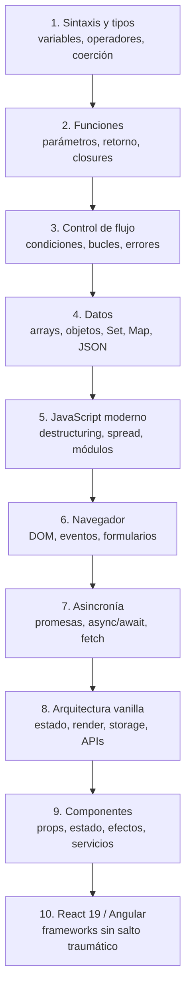
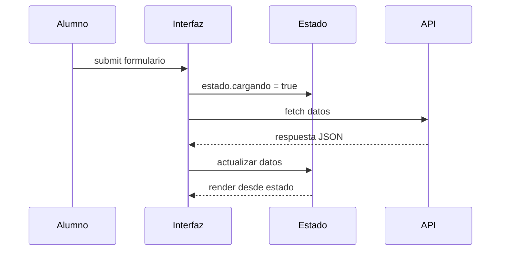

# Apuntes DWEC: JavaScript moderno para llegar a React y Angular sin dolor de cabeza

Material docente de **Desarrollo Web en Entorno Cliente** creado por **Isaías Fernández Lozano (Isaías FL)** para su alumnado.

Este repositorio sirve como ruta de aprendizaje para dominar JavaScript moderno antes de entrar en frameworks como **React 19** o **Angular**. La idea central es sencilla: si el alumno entiende datos, funciones, módulos, DOM, eventos, asincronía, APIs y estado, React y Angular dejan de parecer un salto brusco.

> Revisión documental actualizada a **junio de 2026**. Para tendencias de repositorios se han consultado recomendaciones actuales de GitHub; para React se ha contrastado React 19.2 con Context7; para Node se toma como referencia Node.js 24 LTS.

<p align="center">
  <a href="https://developer.mozilla.org/es/docs/Web/JavaScript"></a>
  <a href="https://nodejs.org/"></a>
  <a href="https://www.npmjs.com/"></a>
  <a href="https://pnpm.io/"></a>
  <a href="https://vite.dev/"></a>
  <a href="https://react.dev/"></a>
  <a href="https://angular.dev/"></a>
  <a href="https://developer.mozilla.org/"></a>
</p>

<p align="center">
  <a href="LICENSE"></a>
  
  
</p>

---

## Índice

- [Objetivo](#objetivo)
- [Stack de aprendizaje](#stack-de-aprendizaje)
- [Roadmap del alumno](#roadmap-del-alumno)
- [Ruta recomendada de estudio](#ruta-recomendada-de-estudio)
- [Índice general del material](#índice-general-del-material)
- [Progreso por competencias](#progreso-por-competencias)
- [Entorno recomendado: Node, nvm, npm y pnpm](#entorno-recomendado-node-nvm-npm-y-pnpm)
- [Diagramas de aprendizaje](#diagramas-de-aprendizaje)
- [Ejercicios](#ejercicios)
- [Puente a React y Angular](#puente-a-react-y-angular)
- [Estructura del repositorio](#estructura-del-repositorio)
- [Tendencias aplicadas al repo](#tendencias-aplicadas-al-repo)
- [Licencia y atribución](#licencia-y-atribución)
- [Autor](#autor)
- [Fuentes](#fuentes)

---

## Objetivo

El objetivo de estos apuntes es que el alumnado aprenda **JavaScript moderno con profundidad suficiente para construir interfaces reales** y pueda pasar después a React o Angular con una base técnica sólida.

Al finalizar la ruta, el alumno debería poder:

- Escribir JavaScript moderno con `let`, `const`, funciones, objetos, arrays, destructuring, módulos y clases.
- Razonar sobre scope, closures, `this`, referencias, mutabilidad e inmutabilidad.
- Usar arrays, objetos, `Set`, `Map` y JSON para modelar datos.
- Manipular el DOM con criterio: selección, creación de nodos, eventos, formularios y clases CSS.
- Trabajar con asincronía: callbacks, promesas, `async/await`, `fetch`, errores y APIs externas.
- Separar estado, lógica, renderizado y persistencia local.
- Entender la transición natural desde JavaScript vanilla hacia componentes, props, estado, efectos y servicios.

---

## Stack de aprendizaje

| Área | Tecnología | Qué aporta al alumno |
| --- | --- | --- |
| Lenguaje | JavaScript moderno ES6+ / ES2026 | Base del desarrollo frontend actual. |
| Documentación | MDN Web Docs | Referencia principal para JavaScript, DOM y Web APIs. |
| Runtime | Node.js 24 LTS | Herramientas modernas, scripts y entorno de desarrollo. |
| Versiones | nvm | Cambiar entre varias versiones de Node sin romper proyectos. |
| Paquetes | npm | Gestor incluido con Node, útil para entender el ecosistema. |
| Paquetes | pnpm | Instalaciones rápidas, eficientes y reproducibles. |
| Tooling | Vite | Proyectos vanilla, React y builds modernos. |
| Navegador | DOM / Web APIs | Eventos, formularios, storage, fetch, workers y APIs reales. |
| Framework destino | React 19 | Componentes, JSX, estado, hooks, Actions y UI declarativa. |
| Framework destino | Angular | Componentes, templates, servicios, inyección y arquitectura. |

---

## Roadmap del alumno



**Regla práctica:** antes de empezar React o Angular, el alumno debe poder crear una miniaplicación vanilla que mantenga estado, renderice desde datos, gestione eventos, valide formularios, consulte una API, maneje errores y separe el código en módulos.

> [!TIP]
> Si una práctica vanilla ya tiene `estado`, `render()`, eventos, validación y `fetch`, ya contiene las piezas mentales que después se transforman en componentes, props, estado, efectos y servicios.

<details>
<summary>Lectura rápida del roadmap</summary>

1. Primero se aprende el lenguaje.
2. Después se aprende a modelar datos.
3. Luego se conecta JavaScript con el navegador.
4. Más tarde se trabaja asincronía y APIs reales.
5. Finalmente se reorganiza todo con arquitectura de componentes.

</details>

---

## Ruta recomendada de estudio

### Fase 1: base del lenguaje

| Orden | Tema | Archivo |
| --- | --- | --- |
| 0 | Introducción a JavaScript moderno | [0_Introduccion.md](Unidad2_Sintaxis_Basica/0_Introduccion.md) |
| 1 | Sintaxis básica | [1_SintaxisBasica.md](Unidad2_Sintaxis_Basica/1_SintaxisBasica.md) |
| 2 | Conversión de tipos | [2_ConversionTipos.md](Unidad2_Sintaxis_Basica/2_ConversionTipos.md) |
| 3 | Carga de JavaScript en HTML | [3_CargarJavaScript.md](Unidad2_Sintaxis_Basica/3_CargarJavaScript.md) |
| 4 | Operadores | [4_Operadores.md](Unidad2_Sintaxis_Basica/4_Operadores.md) |
| 5 | Funciones | [5_Funciones.md](Unidad2_Sintaxis_Basica/5_Funciones.md) |
| 6 | Control de flujo | [6_ControlDeFlujo.md](Unidad2_Sintaxis_Basica/6_ControlDeFlujo.md) |
| 7 | Ámbito, scope y `this` | [7_Ambito_Scope.md](Unidad2_Sintaxis_Basica/7_Ambito_Scope.md) |

### Fase 2: datos, módulos y tooling

| Orden | Tema | Archivo |
| --- | --- | --- |
| 8 | Arrays | [8_Arrays.md](Unidad4_Estructuras_de_datos/8_Arrays.md) |
| 9 | Set | [9_Set.md](Unidad4_Estructuras_de_datos/9_Set.md) |
| 10 | Map | [10_Map.md](Unidad4_Estructuras_de_datos/10_Map.md) |
| 11 | Objetos | [11_Objetos.md](Unidad4_Estructuras_de_datos/11_Objetos.md) |
| 12 | Módulos ES | [12_Modulos.md](Unidad4_Estructuras_de_datos/12_Modulos.md) |
| 13 | npm, pnpm, Node y Vite | [13_NPM.md](Unidad4_Estructuras_de_datos/13_NPM.md) |
| 14 | localStorage | [14_LocalStorage.md](Unidad4_Estructuras_de_datos/14_LocalStorage.md) |
| 15 | `this` en profundidad | [15_Usos_del_this.md](Unidad4_Estructuras_de_datos/15_Usos_del_this.md) |

### Fase 3: programación orientada a objetos

| Orden | Tema | Archivo |
| --- | --- | --- |
| 16 | Prototipos, constructores y clases | [16_POO_basado_en_Prototipos.md](Unidad5_POO_basada_en_Prototipos/16_POO_basado_en_Prototipos.md) |

### Fase 4: navegador, DOM, asincronía y APIs

| Orden | Tema | Archivo |
| --- | --- | --- |
| 17 | DOM | [17_DOM_Document_Object_Model.md](Unidad6_DOM/17_DOM_Document_Object_Model.md) |
| 18 | Callbacks, promesas y async/await | [18_Asincronismo.Callback_Promesas_Async_Await.md](Unidad6_DOM/18_Asincronismo.Callback_Promesas_Async_Await.md) |
| 19 | Web APIs y Fetch API | [19_APIS_JavaScript.md](Unidad6_DOM/19_APIS_JavaScript.md) |

### Fase 5: puente a frameworks

| Orden | Tema | Archivo |
| --- | --- | --- |
| 20 | Práctica puente hacia React 19 | [Practica_Puente_React_19.md](Ejercicios/Practica_Puente_React_19.md) |
| 21 | Unidad de preparación React / Angular | [20_Preparacion_React_Angular.md](Unidad7_Preparacion_React_Angular/20_Preparacion_React_Angular.md) |
| 22 | Guía JS -> React / Angular | [RUTA_JS_REACT_ANGULAR.md](docs/RUTA_JS_REACT_ANGULAR.md) |

Esta fase solo marca el camino. El desarrollo completo está separado en la guía específica para no cargar esta ruta principal.

---

## Índice general del material

Para moverse por todo el repositorio sin perderse:

- [Índice general completo](INDICE_GENERAL.md)
- [Diagramas explicativos](docs/DIAGRAMAS.md)
- [Banco ampliado de ejercicios](Ejercicios/Banco_Ejercicios_JavaScript_Avanzado.md)
- [Ruta JS -> React / Angular](docs/RUTA_JS_REACT_ANGULAR.md)

---

## Progreso por competencias

| Competencia | Estado esperado | Evidencia |
| --- | --- | --- |
| Sintaxis y tipos | Comprende valores, operadores y coerción | Ejercicios de tipos y operadores |
| Funciones | Usa funciones puras, callbacks y closures | Ejercicios de funciones |
| Datos | Transforma arrays y objetos sin mutaciones innecesarias | Banco de arrays/objetos |
| Módulos | Divide código con `import` y `export` | Miniapp con Vite |
| DOM | Crea y actualiza UI desde datos | Prácticas DOM |
| Eventos | Maneja clicks, inputs, submit y delegación | Formularios interactivos |
| Asincronía | Usa promesas, `async/await` y errores | Ejercicios Fetch |
| APIs | Consume endpoints y gestiona estados visuales | Proyecto de clima/API |
| Arquitectura | Separa estado, render, eventos y storage | Proyecto final vanilla |
| Frameworks | Entiende componentes, props, estado y efectos | Puente React/Angular |

### Checklist de madurez

- [ ] Leo y modifico código JavaScript sin depender de copiar ejemplos completos.
- [ ] Sé explicar la diferencia entre dato, evento, estado y renderizado.
- [ ] Sé dividir una práctica en módulos pequeños.
- [ ] Sé depurar errores mirando consola, red y estado.
- [ ] Sé pasar de una solución imperativa a una solución declarativa.
- [ ] Sé justificar cuándo usar `map`, `filter`, `reduce`, `Set` o `Map`.
- [ ] Sé reconocer qué parte de una app vanilla será componente en React o Angular.

---

## Entorno recomendado: Node, nvm, npm y pnpm

### Versión recomendada

Para junio de 2026, la línea recomendada para clase es **Node.js 24 LTS**. Node 26 existe como versión Current, pero para docencia y proyectos estables conviene usar LTS.

Archivo recomendado del repo:

```text
.nvmrc
24
```

### Instalar Node con nvm

En Linux/macOS:

```bash
# Instalar nvm siguiendo la documentación oficial del proyecto
# Después, dentro del repo:
nvm install 24
nvm use 24
node -v
npm -v
```

Instalar varias versiones:

```bash
nvm install 22
nvm install 24
nvm use 24
nvm alias default 24
```

### npm y pnpm

`npm` viene incluido con Node y es imprescindible conocerlo. `pnpm` es muy recomendable para proyectos modernos porque usa el disco de forma más eficiente y hace instalaciones reproducibles.

Activar pnpm con Corepack:

```bash
corepack enable
corepack prepare pnpm@latest --activate
pnpm -v
```

Crear proyectos:

```bash
# JavaScript vanilla con Vite
pnpm create vite practica-js --template vanilla

# React con Vite
pnpm create vite primer-react --template react
```

Comandos habituales:

```bash
pnpm install
pnpm dev
pnpm build
pnpm test
```

---

## Diagramas de aprendizaje

Este repositorio usa diagramas Mermaid porque GitHub los renderiza directamente en Markdown y ayudan mucho a explicar procesos que suelen costar al alumnado.



Más diagramas:

- [Diagramas explicativos](docs/DIAGRAMAS.md)
- [Ruta JS -> React / Angular](docs/RUTA_JS_REACT_ANGULAR.md)

---

## Ejercicios

El repo incluye ejercicios por bloques:

- [Arrays I](Ejercicios/Enunciado_I_Ejercicios_Arrays.md)
- [Arrays II](Ejercicios/Enunciado_II_Ejercicios_Arrays.md)
- [Objetos](Ejercicios/Enunciado_Ejercicios_Objetos.md)
- [Destructuring con objetos](Ejercicios/Enunciado_Ejercicios_Destructuring_con_objetos.md)
- [Promesas y Fetch API](Ejercicios/Enunciado_promesas_fetch.md)
- [Práctica puente hacia React 19](Ejercicios/Practica_Puente_React_19.md)
- [Banco ampliado de ejercicios](Ejercicios/Banco_Ejercicios_JavaScript_Avanzado.md)
- [Ejercicios autocorregibles](Ejercicios/autocorregibles/README.md)

Proyecto recomendado de cierre:

**Gestor de tareas para clase**

- CRUD de tareas.
- Filtros por estado.
- Persistencia en `localStorage`.
- Código modular: `state.js`, `render.js`, `events.js`, `storage.js`, `api.js`.
- Carga inicial desde API.
- Estados visuales de carga y error.
- Versión posterior en React 19 o Angular.

---

## Puente a React y Angular

La parte de frameworks está separada para que el README siga siendo una portada clara:

- [Guía JS -> React / Angular](docs/RUTA_JS_REACT_ANGULAR.md)
- [Práctica puente hacia React 19](Ejercicios/Practica_Puente_React_19.md)

Resumen mental:

| JavaScript vanilla | React | Angular |
| --- | --- | --- |
| Función `render()` | Componente | Componente |
| Objeto `estado` | `useState` / `useReducer` | Signals / propiedades |
| `addEventListener` | `onClick`, `onChange` | `(click)`, `(input)` |
| `FormData` | Actions / formularios | Reactive Forms |
| `fetch` | efectos / loaders / actions | servicios HTTP |
| `localStorage` | efecto + estado | servicio + estado |
| módulos ES | componentes/hooks | módulos/standalone/services |

---

## Estructura del repositorio

```text
ApuntesDWEC/
├── Unidad2_Sintaxis_Basica/
├── Unidad4_Estructuras_de_datos/
├── Unidad5_POO_basada_en_Prototipos/
├── Unidad6_DOM/
├── Unidad7_Preparacion_React_Angular/
├── Ejercicios/
│   └── autocorregibles/
├── docs/
├── .github/
│   └── ISSUE_TEMPLATE/
├── assets/
├── CITATION.cff
├── CONTRIBUTING.md
├── INDICE_GENERAL.md
├── LICENSE
└── README.md
```

---

## Tendencias aplicadas al repo

- README con portada clara, badges, stack visual y ruta de entrada rápida.
- Licencia explícita orientada a material educativo con atribución.
- Archivo `CITATION.cff` para citar correctamente el repo.
- Plantillas de issues para erratas, mejoras y ejercicios.
- Banco de ejercicios ampliado y primera base de autocorrección.
- Separación entre README, guía de framework y ejercicios.
- Roadmap visual con Mermaid compatible con GitHub.
- Diagramas explicativos para procesos complejos: DOM, estado, fetch y frameworks.
- Bloques desplegables con `details` para no saturar la portada.
- Callouts nativos de GitHub (`[!TIP]`, `[!NOTE]`) para remarcar ideas docentes.
- Recomendación de Node LTS, nvm, Corepack y pnpm.

---

## Licencia y atribución

Este material se publica bajo **Creative Commons Attribution 4.0 International (CC BY 4.0)**.

Puedes consultar, compartir y adaptar el contenido, pero debes atribuir la autoría de forma clara:

```text
Apuntes DWEC: JavaScript moderno para llegar a React y Angular sin dolor de cabeza
Autor: Isaías Fernández Lozano (Isaías FL)
Repositorio: https://github.com/isaiasfl/ApuntesDWEC
Licencia: CC BY 4.0
```

La licencia anterior del repositorio era GPLv3, más habitual en software. Para apuntes, ejercicios y material docente, CC BY 4.0 expresa mejor la condición de atribución.

---

## Autor

**Isaías Fernández Lozano (Isaías FL)**
Profesor de Informática en el IES Hermenegildo Lanz (Granada).

- GitHub: [isaiasfl](https://github.com/isaiasfl)
- Correo: [ifernandez@ieshlanz.es](mailto:ifernandez@ieshlanz.es)

---

## Fuentes

- [GitHub Docs: About READMEs](https://docs.github.com/articles/about-readmes)
- [GitHub Docs: workflow status badges](https://docs.github.com/en/actions/how-tos/monitoring-and-troubleshooting-workflows/monitoring-workflows/adding-a-workflow-status-badge)
- [Creative Commons BY 4.0](https://creativecommons.org/licenses/by/4.0/)
- [Node.js Release Schedule](https://github.com/nodejs/Release)
- [Node.js releases](https://nodejs.org/en/about/previous-releases)
- [Node.js Corepack](https://nodejs.org/api/corepack.html)
- [npm Docs](https://docs.npmjs.com/)
- [pnpm Docs](https://pnpm.io/)
- [MDN JavaScript](https://developer.mozilla.org/es/docs/Web/JavaScript)
- [MDN Web APIs](https://developer.mozilla.org/es/docs/Web/API)
- [React Docs](https://react.dev/)
- [React 19](https://react.dev/blog/2024/12/05/react-19)
- [React 19.2](https://react.dev/blog/2025/10/01/react-19-2)
- [Angular Docs](https://angular.dev/)
- [Vite Docs](https://vite.dev/)
