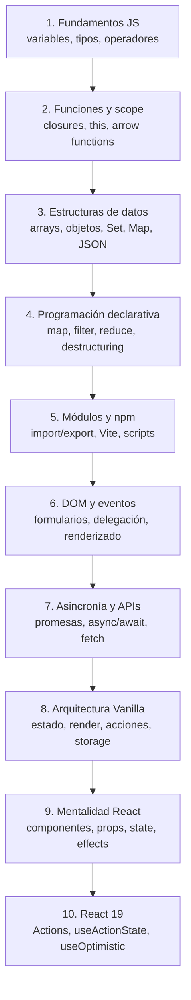

# Apuntes DWEC: JavaScript moderno para llegar a React sin dolor de cabeza

Apuntes, ejemplos y ejercicios de **Desarrollo Web en Entorno Cliente** preparados por **Isaías Fernández Lozano (Isaías FL)** para su alumnado.

Este repositorio está pensado como una ruta completa para dominar las bases importantes de JavaScript moderno antes de pasar a frameworks como **React 19** o **Angular**. El objetivo no es memorizar sintaxis: es aprender a pensar en datos, funciones, módulos, estado, eventos, asincronía y componentes.

> Documentación revisada y actualizada a **junio de 2026**. Para la parte de React se ha contrastado con documentación oficial de React 19.2 mediante Context7 y fuentes oficiales de React.

---

## Índice

- [Objetivo del repo](#objetivo-del-repo)
- [Stack de tecnologías](#stack-de-tecnologías)
- [Roadmap del alumno hacia React](#roadmap-del-alumno-hacia-react)
- [Estructura real del repositorio](#estructura-real-del-repositorio)
- [Ruta recomendada de estudio](#ruta-recomendada-de-estudio)
- [Mapa de competencias](#mapa-de-competencias)
- [JavaScript moderno antes de React 19](#javascript-moderno-antes-de-react-19)
- [Primer contacto con React 19](#primer-contacto-con-react-19)
- [Ejercicios y práctica](#ejercicios-y-práctica)
- [Cómo trabajar con el repo](#cómo-trabajar-con-el-repo)
- [Fuentes actualizadas](#fuentes-actualizadas)
- [Autor](#autor)
- [Licencia](#licencia)

---

## Objetivo del repo

Este repositorio guía al alumno desde los fundamentos de JavaScript hasta una base suficientemente sólida para empezar con React o Angular sin atascarse en conceptos previos.

Al terminar esta ruta, el alumno debería saber:

- Escribir JavaScript moderno con `let`, `const`, funciones, objetos, arrays, destructuring, módulos y clases.
- Entender la diferencia entre código imperativo, declarativo, funcional y orientado a objetos.
- Manipular el DOM con criterio: selección, creación de nodos, eventos, formularios y clases CSS.
- Trabajar con asincronía real: callbacks, promesas, `async/await`, `fetch`, errores y APIs externas.
- Separar datos, lógica y vista para preparar la transición a componentes.
- Comprender por qué React usa estado, props, renderizado declarativo, eventos y efectos.
- Llegar a React 19 con buena base de formularios, estado, acciones, efectos y mentalidad de componentes.

---

## Stack de tecnologías

| Área | Tecnología | Para qué se aprende |
| --- | --- | --- |
| Lenguaje | JavaScript moderno ES6+ | Base principal del desarrollo frontend actual. |
| Plataforma | Navegador Web | Ejecución, DOM, eventos, formularios, storage y APIs del navegador. |
| Runtime | Node.js | Ejecutar herramientas modernas, scripts y gestores de paquetes. |
| Paquetes | npm / pnpm | Instalar dependencias, lanzar scripts y preparar proyectos reales. |
| Build tool | Vite | Crear proyectos vanilla y después proyectos React modernos. |
| Datos | Arrays, Set, Map, Object, JSON | Modelar información antes de pintarla en pantalla. |
| Modularidad | ES Modules | Dividir código con `import`, `export` e importaciones dinámicas. |
| Persistencia local | `localStorage` / `sessionStorage` | Guardar preferencias, estado simple y datos de usuario. |
| Asincronía | Promises, `async/await`, Fetch API | Consumir APIs y controlar errores de red. |
| UI Vanilla | DOM, eventos, formularios | Entender que resuelve React por debajo. |
| Framework destino | React 19 | Componentes, JSX, props, estado, hooks, acciones y efectos. |
| Framework alternativo | Angular | Componentes, servicios, templates, estado y comunicación con APIs. |

---

## Roadmap del alumno hacia React



### Regla práctica

Antes de empezar React, un alumno debe poder construir en JavaScript vanilla una miniaplicación que:

- Mantenga un estado en un objeto o array.
- Pinte una interfaz a partir de ese estado.
- Responda a eventos del usuario.
- Valide un formulario.
- Consulte una API con `fetch`.
- Gestione errores y estados de carga.
- Separe el código en módulos.

Si eso está claro, React deja de parecer magia.

---

## Estructura real del repositorio

```text
ApuntesDWEC/
├── Unidad2_Sintaxis_Basica/
│   ├── 0_Introduccion.md
│   ├── 1_SintaxisBasica.md
│   ├── 2_ConversionTipos.md
│   ├── 3_CargarJavaScript.md
│   ├── 4_Operadores.md
│   ├── 5_Funciones.md
│   ├── 6_ControlDeFlujo.md
│   └── 7_Ambito_Scope.md
├── Unidad4_Estructuras_de_datos/
│   ├── 8_Arrays.md
│   ├── 9_Set.md
│   ├── 10_Map.md
│   ├── 11_Objetos.md
│   ├── 12_Modulos.md
│   ├── 13_NPM.md
│   ├── 14_LocalStorage.md
│   └── 15_Usos_del_this.md
├── Unidad5_POO_basada_en_Prototipos/
│   └── 16_POO_basado_en_Prototipos.md
├── Unidad6_DOM/
│   ├── 17_DOM_Document_Object_Model.md
│   ├── 18_Asincronismo.Callback_Promesas_Async_Await.md
│   └── 19_APIS_JavaScript.md
├── Ejercicios/
│   ├── Enunciado_I_Ejercicios_Arrays.md
│   ├── Enunciado_II_Ejercicios_Arrays.md
│   ├── Enunciado_Ejercicios_Objetos.md
│   ├── Enunciado_Ejercicios_Destructuring_con_objetos.md
│   ├── Enunciado_promesas_fetch.md
│   └── Practica_Puente_React_19.md
├── assets/
├── LICENSE
└── README.md
```

---

## Ruta recomendada de estudio

### Fase 1: base del lenguaje

1. [Introducción a JavaScript moderno](Unidad2_Sintaxis_Basica/0_Introduccion.md)
2. [Sintaxis básica](Unidad2_Sintaxis_Basica/1_SintaxisBasica.md)
3. [Conversiones de tipos](Unidad2_Sintaxis_Basica/2_ConversionTipos.md)
4. [Carga de JavaScript en HTML](Unidad2_Sintaxis_Basica/3_CargarJavaScript.md)
5. [Operadores](Unidad2_Sintaxis_Basica/4_Operadores.md)
6. [Funciones](Unidad2_Sintaxis_Basica/5_Funciones.md)
7. [Control de flujo](Unidad2_Sintaxis_Basica/6_ControlDeFlujo.md)
8. [Ámbito, scope y `this`](Unidad2_Sintaxis_Basica/7_Ambito_Scope.md)

### Fase 2: datos y organización

1. [Arrays](Unidad4_Estructuras_de_datos/8_Arrays.md)
2. [Set](Unidad4_Estructuras_de_datos/9_Set.md)
3. [Map](Unidad4_Estructuras_de_datos/10_Map.md)
4. [Objetos](Unidad4_Estructuras_de_datos/11_Objetos.md)
5. [Módulos ES](Unidad4_Estructuras_de_datos/12_Modulos.md)
6. [npm y Vite](Unidad4_Estructuras_de_datos/13_NPM.md)
7. [localStorage](Unidad4_Estructuras_de_datos/14_LocalStorage.md)
8. [`this` en profundidad](Unidad4_Estructuras_de_datos/15_Usos_del_this.md)

### Fase 3: programación orientada a objetos

1. [POO basada en prototipos](Unidad5_POO_basada_en_Prototipos/16_POO_basado_en_Prototipos.md)

Esta fase es importante porque React y Angular no obligan a programar con clases, pero sí exigen entender objetos, referencias, métodos, encapsulación y reutilización de comportamiento.

### Fase 4: navegador, DOM y APIs

1. [DOM](Unidad6_DOM/17_DOM_Document_Object_Model.md)
2. [Asincronismo, promesas y async/await](Unidad6_DOM/18_Asincronismo.Callback_Promesas_Async_Await.md)
3. [APIs de JavaScript](Unidad6_DOM/19_APIS_JavaScript.md)

Esta fase es la antesala real de React: eventos, formularios, renderizado, peticiones HTTP, errores y estado visual.

### Fase 5: puente a React 19

1. [Práctica puente hacia React 19](Ejercicios/Practica_Puente_React_19.md)

Aquí se trabaja la misma idea primero en JavaScript vanilla y después con mentalidad React: estado, render, acciones, formularios y componentes.

---

## Mapa de competencias

| Competencia | En JavaScript vanilla | Cómo se traduce en React |
| --- | --- | --- |
| Pintar datos | `createElement`, `innerHTML`, templates | JSX y componentes |
| Estado | Variables, objetos, arrays | `useState`, `useReducer` |
| Eventos | `addEventListener` | `onClick`, `onChange`, `onSubmit` |
| Formularios | `FormData`, validación manual | Inputs controlados, Actions, `useActionState` |
| Efectos | Código tras eventos/carga | `useEffect`, `useEffectEvent` |
| APIs | `fetch`, `async/await` | Fetch en efectos, loaders o frameworks |
| Renderizado | Función `render()` propia | Renderizado declarativo de React |
| Componentización | Funciones que devuelven HTML/nodos | Componentes reutilizables |
| Persistencia | `localStorage` | Estado + efectos + storage |
| Modularidad | `import` / `export` | Componentes, hooks y servicios separados |

---

## JavaScript moderno antes de React 19

Estos conceptos deben quedar especialmente claros:

### 1. Inmutabilidad básica

React funciona mucho mejor cuando se crean nuevos arrays u objetos en lugar de mutar los existentes.

```javascript
const alumnos = ["Ana", "Luis"];

// Evitamos mutar el array original cuando queremos generar nuevo estado.
const alumnosActualizados = [...alumnos, "Marta"];

console.log(alumnos); // ["Ana", "Luis"]
console.log(alumnosActualizados); // ["Ana", "Luis", "Marta"]
```

### 2. Renderizado desde datos

Antes de React, se puede practicar con una función `render()` propia.

```javascript
const tareas = [
  { id: 1, texto: "Repasar arrays", completada: true },
  { id: 2, texto: "Practicar fetch", completada: false },
];

function renderTareas(lista) {
  return lista
    .map((tarea) => {
      const estado = tarea.completada ? "hecha" : "pendiente";
      return `<li data-id="${tarea.id}">${tarea.texto} - ${estado}</li>`;
    })
    .join("");
}

document.querySelector("#app").innerHTML = `<ul>${renderTareas(tareas)}</ul>`;
```

### 3. Eventos como acciones

En React se piensa mucho en acciones de usuario: añadir, borrar, filtrar, guardar.

```javascript
const estado = {
  filtro: "todas",
  tareas: [],
};

function agregarTarea(texto) {
  // La función recibe una intención y produce un nuevo estado.
  estado.tareas = [
    ...estado.tareas,
    { id: crypto.randomUUID(), texto, completada: false },
  ];
}
```

### 4. Asincronía con estados visuales

Todo fetch real necesita al menos tres estados: carga, éxito y error.

```javascript
async function cargarUsuario(id) {
  try {
    mostrarCargando();

    const respuesta = await fetch(`https://jsonplaceholder.typicode.com/users/${id}`);

    if (!respuesta.ok) {
      throw new Error(`Error HTTP: ${respuesta.status}`);
    }

    const usuario = await respuesta.json();
    mostrarUsuario(usuario);
  } catch (error) {
    mostrarError(error.message);
  }
}
```

---

## Primer contacto con React 19

React permite crear interfaces declarativas a partir de componentes. En lugar de modificar el DOM paso a paso, se describe que debe verse para un estado determinado.

### Componente básico

```jsx
function TarjetaAlumno({ nombre, curso }) {
  return (
    <article>
      <h2>{nombre}</h2>
      <p>{curso}</p>
    </article>
  );
}
```

### Estado con `useState`

```jsx
import { useState } from "react";

function Contador() {
  const [contador, setContador] = useState(0);

  return (
    <button onClick={() => setContador(contador + 1)}>
      Clicks: {contador}
    </button>
  );
}
```

### Formularios y acciones en React 19

React 19 introdujo mejoras importantes en el trabajo con acciones asíncronas, formularios y estado optimista. Conceptos a conocer:

- **Actions**: funciones normalmente asíncronas que gestionan una mutación o envío de datos.
- **`useActionState`**: ayuda a manejar el resultado de una acción de formulario.
- **`useOptimistic`**: permite mostrar una actualización inmediata antes de que el servidor confirme.
- **`useTransition` / `startTransition`**: marcan actualizaciones no urgentes.
- **`useEffectEvent`** en React 19.2: separa eventos disparados desde efectos para evitar dependencias incorrectas.
- **`<Activity />`** en React 19.2: permite ocultar/mostrar partes de la UI conservando estado y priorizando trabajo.

Ejemplo conceptual de `useActionState`:

```jsx
import { useActionState } from "react";

async function guardarAlumno(estadoAnterior, formData) {
  const nombre = formData.get("nombre")?.trim();

  if (!nombre) {
    return { ok: false, mensaje: "El nombre es obligatorio" };
  }

  // Aquí normalmente se llamaría a una API o acción de servidor.
  return { ok: true, mensaje: `Alumno guardado: ${nombre}` };
}

function FormularioAlumno() {
  const [estado, accion, pendiente] = useActionState(guardarAlumno, {
    ok: null,
    mensaje: "",
  });

  return (
    <form action={accion}>
      <input name="nombre" placeholder="Nombre del alumno" />
      <button disabled={pendiente}>
        {pendiente ? "Guardando..." : "Guardar"}
      </button>
      {estado.mensaje && <p>{estado.mensaje}</p>}
    </form>
  );
}
```

### Importante para alumnos

React no elimina JavaScript. React exige JavaScript mejor escrito.

Antes de usar hooks, conviene dominar:

- Funciones puras.
- Arrays con `map`, `filter`, `find`, `some`, `every` y `reduce`.
- Objetos y copia con spread.
- Destructuring.
- Promesas y `async/await`.
- Eventos y formularios.
- Módulos ES.

---

## Ejercicios y práctica

El repositorio incluye ejercicios de:

- [Arrays I](Ejercicios/Enunciado_I_Ejercicios_Arrays.md)
- [Arrays II](Ejercicios/Enunciado_II_Ejercicios_Arrays.md)
- [Objetos](Ejercicios/Enunciado_Ejercicios_Objetos.md)
- [Destructuring con objetos](Ejercicios/Enunciado_Ejercicios_Destructuring_con_objetos.md)
- [Promesas y Fetch API](Ejercicios/Enunciado_promesas_fetch.md)
- [Práctica puente hacia React 19](Ejercicios/Practica_Puente_React_19.md)

### Proyecto recomendado de cierre

Construir una miniaplicación vanilla con Vite:

**Gestor de tareas para clase**

Requisitos:

- Crear, completar, editar y borrar tareas.
- Filtrar por todas, pendientes y completadas.
- Guardar en `localStorage`.
- Separar en módulos: `state.js`, `render.js`, `events.js`, `storage.js`.
- Usar un único objeto de estado.
- Renderizar siempre desde el estado.
- Añadir una versión posterior en React 19 con componentes.

---

## Cómo trabajar con el repo

Clonar el repositorio:

```bash
git clone https://github.com/isaiasfl/ApuntesDWEC.git
cd ApuntesDWEC
```

Para practicar con Vite en un proyecto nuevo:

```bash
npm create vite@latest practica-js -- --template vanilla
cd practica-js
npm install
npm run dev
```

Para crear el primer proyecto React cuando la base de JavaScript esté asentada:

```bash
npm create vite@latest primer-react -- --template react
cd primer-react
npm install
npm run dev
```

---

## Fuentes actualizadas

Fuentes recomendadas para mantener estos apuntes al día:

- [MDN JavaScript](https://developer.mozilla.org/es/docs/Web/JavaScript)
- [MDN Web APIs](https://developer.mozilla.org/es/docs/Web/API)
- [MDN Fetch API](https://developer.mozilla.org/es/docs/Web/API/Fetch_API)
- [Documentación oficial de React](https://react.dev/)
- [React 19](https://react.dev/blog/2024/12/05/react-19)
- [React 19.2](https://react.dev/blog/2025/10/01/react-19-2)
- [Vite](https://vite.dev/)
- [Node.js](https://nodejs.org/)
- [npm](https://docs.npmjs.com/)

---

## Autor

Material desarrollado por **Isaías Fernández Lozano (Isaías FL)**, profesor de Informática en el IES Hermenegildo Lanz (Granada), para su alumnado.

- GitHub: [isaiasfl](https://github.com/isaiasfl)
- Correo: [ifernandez@ieshlanz.es](mailto:ifernandez@ieshlanz.es)

---

## Licencia

Este proyecto se distribuye bajo la licencia indicada en [LICENSE](LICENSE).
