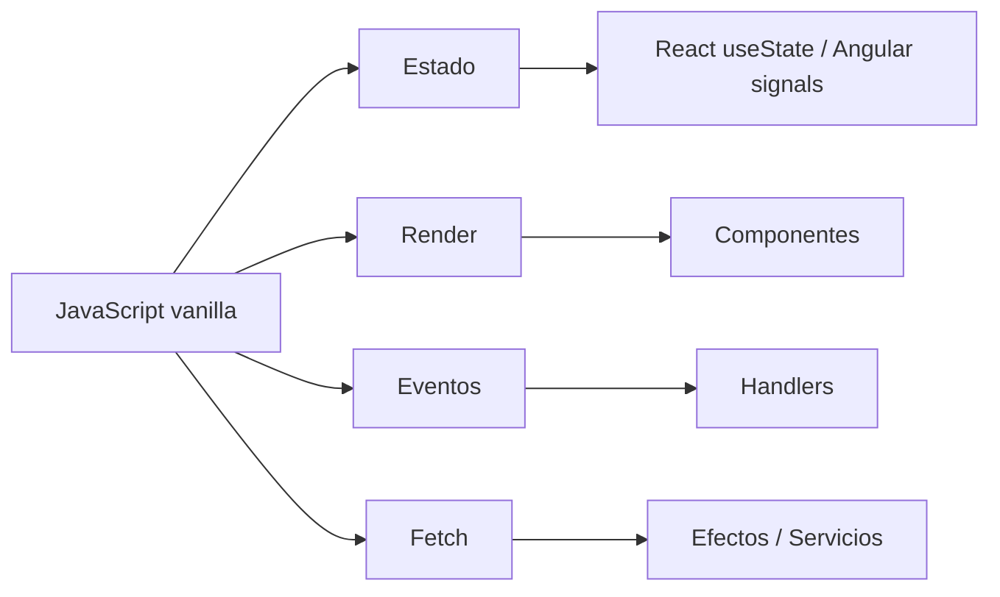

# 20. Preparación para React 19 y Angular desde JavaScript moderno

[Volver al índice general](../INDICE_GENERAL.md)

Esta unidad sirve como cierre del bloque de JavaScript y como puente hacia frameworks. No sustituye a un curso de React o Angular: ordena los conceptos de JavaScript que deben estar claros antes de empezar.

---

## 20.1. Qué debe saber el alumno antes de empezar

- Crear funciones pequeñas y reutilizables.
- Transformar arrays con `map`, `filter`, `find`, `some`, `every` y `reduce`.
- Copiar objetos y arrays sin mutarlos directamente.
- Desestructurar objetos y arrays.
- Usar módulos ES con `import` y `export`.
- Entender eventos del DOM y formularios.
- Consumir APIs con `fetch` y `async/await`.
- Gestionar estados de carga, éxito y error.
- Separar estado, renderizado, eventos, API y persistencia.

---

## 20.2. De función render a componente

En JavaScript vanilla podemos escribir:

```javascript
function renderAlumno(alumno) {
  return `
    <article>
      <h2>${alumno.nombre}</h2>
      <p>${alumno.curso}</p>
    </article>
  `;
}
```

En React, la misma idea se convierte en componente:

```jsx
function AlumnoCard({ alumno }) {
  return (
    <article>
      <h2>{alumno.nombre}</h2>
      <p>{alumno.curso}</p>
    </article>
  );
}
```

En Angular, se reparte entre clase y template:

```typescript
type Alumno = {
  nombre: string;
  curso: string;
};
```

```html
<article>
  <h2>{{ alumno.nombre }}</h2>
  <p>{{ alumno.curso }}</p>
</article>
```

---

## 20.3. De estado manual a estado de framework

```javascript
const estado = {
  tareas: [],
  filtro: "todas",
};
```

En React:

```jsx
const [tareas, setTareas] = useState([]);
const [filtro, setFiltro] = useState("todas");
```

En Angular moderno:

```typescript
tareas = signal<Tarea[]>([]);
filtro = signal("todas");
```

---

## 20.4. Diagrama mental



---

## 20.5. Proyecto de cierre recomendado

Crear un gestor académico con:

- listado de tareas o entregas;
- creación mediante formulario;
- edición y borrado;
- filtros;
- persistencia en `localStorage`;
- carga inicial desde API;
- separación en módulos;
- versión posterior en React o Angular.

---

## 20.6. Material relacionado

- [Ruta JS -> React / Angular](../docs/RUTA_JS_REACT_ANGULAR.md)
- [Práctica puente React 19](../Ejercicios/Practica_Puente_React_19.md)
- [Diagramas explicativos](../docs/DIAGRAMAS.md)
- [Banco ampliado de ejercicios](../Ejercicios/Banco_Ejercicios_JavaScript_Avanzado.md)

---

[Volver al índice general](../INDICE_GENERAL.md)
