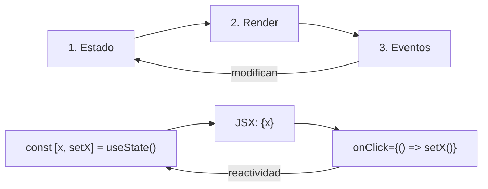

# 20. Preparación para React 19 y Angular desde JavaScript moderno

- [20. Preparación para React 19 y Angular desde JavaScript moderno](#20-preparación-para-react-19-y-angular-desde-javascript-moderno)
  - [20.1. Checklist previa: ¿estoy listo?](#201-checklist-previa-estoy-listo)
    - [20.1.1. Lenguaje y datos](#2011-lenguaje-y-datos)
    - [20.1.2. Organización y reutilización](#2012-organización-y-reutilización)
    - [20.1.3. Navegador y UI](#2013-navegador-y-ui)
    - [20.1.4. Asincronía y APIs](#2014-asincronía-y-apis)
    - [20.1.5. Tabla resumen: qué usa cada framework](#2015-tabla-resumen-qué-usa-cada-framework)
  - [20.2. Patrones vanilla que se transforman en frameworks](#202-patrones-vanilla-que-se-transforman-en-frameworks)
    - [20.2.1. De `render()` a componente](#2021-de-render-a-componente)
    - [20.2.2. De estado manual a `useState` / `signals`](#2022-de-estado-manual-a-usestate--signals)
    - [20.2.3. De `addEventListener` a handlers declarativos](#2023-de-addeventlistener-a-handlers-declarativos)
    - [20.2.4. De `fetch` manual a efectos y servicios](#2024-de-fetch-manual-a-efectos-y-servicios)
    - [20.2.5. De `innerHTML` a JSX / templates con listas](#2025-de-innerhtml-a-jsx--templates-con-listas)
    - [20.2.6. De formularios vanilla a Actions / Reactive Forms](#2026-de-formularios-vanilla-a-actions--reactive-forms)
    - [20.2.7. De `localStorage` manual a hooks de persistencia](#2027-de-localstorage-manual-a-hooks-de-persistencia)
  - [20.3. Ejemplo completo: la misma mini-app en los tres mundos](#203-ejemplo-completo-la-misma-mini-app-en-los-tres-mundos)
    - [20.3.1. Vanilla: gestor de tareas con estado + render + eventos](#2031-vanilla-gestor-de-tareas-con-estado--render--eventos)
    - [20.3.2. React 19: mismo gestor con componentes y hooks](#2032-react-19-mismo-gestor-con-componentes-y-hooks)
    - [20.3.3. Angular: mismo gestor con standalone + signals](#2033-angular-mismo-gestor-con-standalone--signals)
  - [20.4. Diagramas comparativos](#204-diagramas-comparativos)
    - [Flujo de datos en vanilla vs React vs Angular](#flujo-de-datos-en-vanilla-vs-react-vs-angular)
    - [Ciclo estado → render → eventos](#ciclo-estado--render--eventos-universal-en-los-3-paradigmas)
    - [Flujo de interacción: imperativo vs declarativo](#flujo-de-interacción-del-usuario-imperativo-vs-declarativo)
    - [Traducción mental: lo que sabes → lo que usarás](#traducción-mental-lo-que-sabes--lo-que-usarás)
  - [20.5. Proyecto de cierre recomendado](#205-proyecto-de-cierre-recomendado)
  - [20.6. Material relacionado](#206-material-relacionado)

---

[Volver al índice general](../INDICE_GENERAL.md)

Esta unidad cierra el bloque de JavaScript y sirve de puente hacia React 19 y Angular. No sustituye a un curso de frameworks: **ordena los conceptos de JavaScript que deben estar claros antes de empezar** y muestra cómo se transforman en patrones de framework.

> **Idea clave:** React y Angular no son lenguajes nuevos. Son JavaScript con esteroides. Todo lo que haces en un framework tiene un equivalente en vanilla. Si entiendes el equivalente vanilla, el framework deja de ser magia.

---

## 20.1. Checklist previa: ¿estoy listo?

Antes de tocar React o Angular, repasa esto. Si algo falla, vuelve a la unidad correspondiente.

### 20.1.1. Lenguaje y datos

```javascript
// ¿Entiendes esto sin dudar?
const alumnos = [
  { nombre: "Isaías", notas: [7, 8, 9] },
  { nombre: "Ana", notas: [5, 6, 7] },
];

// Transformar sin mutar: map, filter, reduce
const aprobados = alumnos
  .filter((a) => a.notas.reduce((s, n) => s + n, 0) / a.notas.length >= 5)
  .map((a) => ({ ...a, media: a.notas.reduce((s, n) => s + n, 0) / a.notas.length }));

// Desestructurar
const [{ nombre: primero }] = aprobados; // "Isaías"

// Spread para no mutar
const nuevoAlumno = { ...alumnos[0], curso: "DWEC" };

// Set para valores únicos
const cursos = new Set(alumnos.map((a) => a.curso));
```

> Si alguna de estas líneas te chirría, repasa las unidades 8-11 antes de seguir.

### 20.1.2. Organización y reutilización

```javascript
// Módulos ES: separar lógica en archivos pequeños
// state.js
export const estado = { tareas: [], filtro: "todas" };

// render.js
export function renderTareas(tareas) { /* ... */ }

// events.js
export function bindEventos() { /* ... */ }

// app.js — punto de entrada
import { estado } from "./state.js";
import { renderTareas } from "./render.js";
import { bindEventos } from "./events.js";
```

Esa misma separación (`state.js`, `render.js`, `events.js`) es la base mental para entender componentes, servicios y stores en cualquier framework.

### 20.1.3. Navegador y UI

```javascript
// Delegación de eventos — patrón esencial en React/Angular
document.getElementById("lista").addEventListener("click", (e) => {
  const btn = e.target.closest("[data-accion]");
  if (!btn) return;
  const accion = btn.dataset.accion;  // "editar" | "borrar"
  const id = btn.closest("li").dataset.id;
  // manejar accion...
});

// classList, dataset y atributos
elemento.classList.toggle("activo");
console.log(elemento.dataset.id);
elemento.setAttribute("aria-expanded", "true");
```

### 20.1.4. Asincronía y APIs

```javascript
// Patrón completo: carga + éxito + error + cancelación
async function cargarDatos(url, signal) {
  try {
    renderCargando(true);                    // 1. UI: mostrar spinner
    const res = await fetch(url, { signal });
    if (!res.ok) throw new Error(`HTTP ${res.status}`);
    const datos = await res.json();
    renderExito(datos);                      // 2. UI: mostrar datos
  } catch (err) {
    if (err.name === "AbortError") return;   // 3. Cancelado, no hacer nada
    renderError(err.message);                // 4. UI: mostrar error
  } finally {
    renderCargando(false);                   // 5. UI: ocultar spinner
  }
}

// Con AbortController para cancelar
const controller = new AbortController();
cargarDatos("/api/alumnos", controller.signal);
// controller.abort(); // cancela si es necesario
```

Este patrón de 5 estados (loading → success | error | aborted → done) es **exactamente** lo que se convierte en `useEffect`, `use`, Angular `HttpClient` + signals, o loaders de React Router.

### 20.1.5. Tabla resumen: qué usa cada framework

| Concepto JS vanilla | React 19 | Angular moderno |
|:---|:---|:---|
| `function render(datos)` | Componente (`function Component()`) | Componente (`@Component`) |
| Objeto `estado` | `useState` / `useReducer` | `signal()` / `linkedSignal()` |
| `addEventListener` | `onClick`, `onChange`, `onSubmit` | `(click)`, `(input)`, `(ngSubmit)` |
| `fetch` + `try/catch` | `useEffect` + `fetch` / React Query | `HttpClient` + `resource()` |
| `localStorage` | `useEffect` + estado | Servicio + signal |
| `map()` para listas | `{items.map(i => <Item/>)}` | `@for (item of items) {}` |
| `if/else` condicional | `{cond && <Comp/>}` / ternario | `@if (cond) {} @else {}` |
| `classList.toggle()` | `className` condicional / clsx | `[class.active]="cond"` |
| `FormData` | Actions / `useFormStatus` | Reactive Forms / `ngModel` |
| Módulos ES | `import`/`export` componentes | `import`/`export` + DI |
| `AbortController` | cleanup en `useEffect` | `takeUntilDestroyed()` / `DestroyRef` |

---

## 20.2. Patrones vanilla que se transforman en frameworks

Cada patrón se muestra en **tres versiones**: vanilla → React 19 → Angular moderno. Así ves la evolución.

### 20.2.1. De `render()` a componente

**Vanilla — una función que devuelve HTML:**

```javascript
// La función render es el "componente" más primitivo
function renderAlumno(alumno) {
  return `
    <article class="alumno-card">
      <h2>${alumno.nombre}</h2>
      <p>Curso: ${alumno.curso}</p>
      <p>Nota media: ${alumno.media.toFixed(1)}</p>
    </article>
  `;
}

// Uso: insertar en el DOM
const app = document.getElementById("app");
const isaias = { nombre: "Isaías FL", curso: "DWEC", media: 8.5 };
app.innerHTML = renderAlumno(isaias);
```

**React 19 — la función ES el componente:**

```jsx
// Misma idea, pero devuelve JSX (HTML dentro de JS) en vez de un string
function AlumnoCard({ alumno }) {
  return (
    <article className="alumno-card">
      <h2>{alumno.nombre}</h2>
      <p>Curso: {alumno.curso}</p>
      <p>Nota media: {alumno.media.toFixed(1)}</p>
    </article>
  );
}

// Uso: React lo monta por ti, no necesitas innerHTML
// <AlumnoCard alumno={isaias} />
```

**Angular — clase + template + decorador:**

```typescript
// alumno-card.component.ts
import { Component, input } from "@angular/core";

@Component({
  selector: "app-alumno-card",
  template: `
    <article class="alumno-card">
      <h2>{{ alumno().nombre }}</h2>
      <p>Curso: {{ alumno().curso }}</p>
      <p>Nota media: {{ alumno().media.toFixed(1) }}</p>
    </article>
  `,
  standalone: true,
})
export class AlumnoCardComponent {
  alumno = input.required<{ nombre: string; curso: string; media: number }>();
}
```

> **Lo importante:** en los tres casos la idea es la misma — una función/clase que recibe datos y devuelve UI. El framework añade reactividad, ciclo de vida y re-renderizado automático.

### 20.2.2. De estado manual a `useState` / `signals`

**Vanilla — un objeto y una función que repinta:**

```javascript
// Estado: un simple objeto
const estado = { contador: 0 };

// Cada vez que cambia el estado, repintamos
function actualizarEstado(nuevoEstado) {
  Object.assign(estado, nuevoEstado);
  render(); // re-renderiza toda la UI
}

function incrementar() {
  actualizarEstado({ contador: estado.contador + 1 });
}

function render() {
  document.getElementById("app").innerHTML = `
    <p>Contador: ${estado.contador}</p>
    <button id="btn-incrementar">+1</button>
  `;
  document.getElementById("btn-incrementar").addEventListener("click", incrementar);
}
```

**React 19 — `useState` vincula valor + setter:**

```jsx
import { useState } from "react";

function Contador() {
  const [contador, setContador] = useState(0); // ← estado reactivo

  return (
    <>
      <p>Contador: {contador}</p>
      {/* React re-renderiza automáticamente al llamar setContador */}
      <button onClick={() => setContador((c) => c + 1)}>+1</button>
    </>
  );
}
```

**Angular — `signal()` como estado reactivo:**

```typescript
import { Component, signal } from "@angular/core";

@Component({
  selector: "app-contador",
  template: `
    <p>Contador: {{ contador() }}</p>
    <!-- Angular re-renderiza automáticamente al cambiar el signal -->
    <button (click)="contador.set(contador() + 1)">+1</button>
  `,
  standalone: true,
})
export class ContadorComponent {
  contador = signal(0);
}
```

> **Diferencia clave:** en vanilla, tú llamas a `render()` manualmente. En React/Angular, el framework detecta el cambio de estado y repinta **solo lo necesario** automáticamente.

### 20.2.3. De `addEventListener` a handlers declarativos

**Vanilla — listener imperativo:**

```javascript
// Buscar el elemento, añadir listener, buscar otro elemento, añadir otro listener...
document.getElementById("btn-guardar").addEventListener("click", () => {
  const nombre = document.getElementById("input-nombre").value;
  console.log("Guardando:", nombre);
});

// Problema: si el elemento no existe aún (no se ha renderizado), el listener no se asigna.
// Solución vanilla: delegación de eventos o reasignar tras cada render.
```

**React — handlers declarativos en el JSX:**

```jsx
function Formulario() {
  const [nombre, setNombre] = useState("");

  function handleSubmit(e) {
    e.preventDefault();
    console.log("Guardando:", nombre);
  }

  return (
    <form onSubmit={handleSubmit}>
      {/* El listener va PEGADO al elemento en el JSX */}
      <input value={nombre} onChange={(e) => setNombre(e.target.value)} />
      <button type="submit">Guardar</button>
    </form>
  );
}
```

**Angular — bindings en el template:**

```typescript
@Component({
  selector: "app-formulario",
  template: `
    <form (ngSubmit)="guardar()">
      <!-- (input) es el listener, [value] es el binding bidireccional -->
      <input [ngModel]="nombre()" (ngModelChange)="nombre.set($event)" />
      <button type="submit">Guardar</button>
    </form>
  `,
  standalone: true,
  imports: [FormsModule],
})
export class FormularioComponent {
  nombre = signal("");

  guardar() {
    console.log("Guardando:", this.nombre());
  }
}
```

> **Lo importante:** en React/Angular no buscas elementos con `getElementById`. El handler va declarado donde está el elemento. Sin selectores, sin `addEventListener`, sin delegación manual.

### 20.2.4. De `fetch` manual a efectos y servicios

**Vanilla — fetch con gestión manual de estados:**

```javascript
let cargando = false;
let error = null;
let datos = null;

async function cargarAlumnos() {
  cargando = true; error = null; render();
  try {
    const res = await fetch("/api/alumnos");
    if (!res.ok) throw new Error(`Error ${res.status}`);
    datos = await res.json();
  } catch (err) {
    error = err.message;
  } finally {
    cargando = false;
    render();
  }
}

function render() {
  const app = document.getElementById("app");
  if (cargando) return app.innerHTML = "<p>Cargando...</p>";
  if (error) return app.innerHTML = `<p class='error'>${error}</p>`;
  if (!datos) return app.innerHTML = "<p>Sin datos</p>";
  app.innerHTML = `<ul>${datos.map(a => `<li>${a.nombre}</li>`).join("")}</ul>`;
}
```

**React 19 — `useEffect` + estado:**

```jsx
function ListaAlumnos() {
  const [datos, setDatos] = useState(null);
  const [cargando, setCargando] = useState(true);
  const [error, setError] = useState(null);

  useEffect(() => {
    const controller = new AbortController(); // ← cancelar si el componente se desmonta

    async function cargar() {
      setCargando(true); setError(null);
      try {
        const res = await fetch("/api/alumnos", { signal: controller.signal });
        if (!res.ok) throw new Error(`Error ${res.status}`);
        setDatos(await res.json());
      } catch (err) {
        if (err.name !== "AbortError") setError(err.message);
      } finally {
        setCargando(false);
      }
    }

    cargar();
    return () => controller.abort(); // ← cleanup: cancela si el componente desaparece
  }, []); // ← array vacío = "solo al montar"

  if (cargando) return <p>Cargando...</p>;
  if (error) return <p className="error">{error}</p>;
  if (!datos) return <p>Sin datos</p>;
  return <ul>{datos.map((a) => <li key={a.id}>{a.nombre}</li>)}</ul>;
}
```

**Angular — `HttpClient` + `resource()` (Angular 19+):**

```typescript
import { HttpClient } from "@angular/common/http";
import { Component, resource } from "@angular/core";

@Component({
  selector: "app-lista-alumnos",
  template: `
    @if (alumnos.isLoading()) {
      <p>Cargando...</p>
    } @else if (alumnos.error()) {
      <p class="error">{{ alumnos.error() }}</p>
    } @else {
      <ul>
        @for (a of alumnos.value(); track a.id) {
          <li>{{ a.nombre }}</li>
        }
      </ul>
    }
  `,
  standalone: true,
})
export class ListaAlumnosComponent {
  http = inject(HttpClient);

  alumnos = resource({
    loader: () => this.http.get<Alumno[]>("/api/alumnos"),
  });
}
```

> **Lo que ganas:** en vanilla gestionas 3 variables (`cargando`, `error`, `datos`) y llamas a `render()` a mano. En React usas 3 `useState` (o un `useReducer`). En Angular, `resource()` encapsula los 3 estados.

### 20.2.5. De `innerHTML` a JSX / templates con listas

**Vanilla — concatenar strings:**

```javascript
function renderLista(items) {
  return `<ul>${items.map((item) => `<li>${item.nombre}</li>`).join("")}</ul>`;
}
// Problemas: sin escape automático (XSS), difícil de leer, sin eventos por elemento.
```

**React — JSX con `.map()`:**

```jsx
function Lista({ items }) {
  return (
    <ul>
      {items.map((item) => (
        <li key={item.id}> {/* ← key es obligatorio para rendimiento */}
          {item.nombre}
          <button onClick={() => borrar(item.id)}>X</button>
        </li>
      ))}
    </ul>
  );
}
```

**Angular — `@for` en el template:**

```html
<ul>
  @for (item of items; track item.id) {
    <!-- track es obligatorio (equivalente a key en React) -->
    <li>
      {{ item.nombre }}
      <button (click)="borrar(item.id)">X</button>
    </li>
  } @empty {
    <li>No hay elementos</li>
  }
</ul>
```

### 20.2.6. De formularios vanilla a Actions / Reactive Forms

**Vanilla — FormData manual:**

```javascript
document.getElementById("form-alumno").addEventListener("submit", async (e) => {
  e.preventDefault();
  const formData = new FormData(e.target);
  const datos = Object.fromEntries(formData);

  // Validación manual
  if (!datos.nombre || datos.nombre.length < 3) {
    mostrarError("El nombre debe tener al menos 3 caracteres");
    return;
  }

  await fetch("/api/alumnos", {
    method: "POST",
    headers: { "Content-Type": "application/json" },
    body: JSON.stringify(datos),
  });
});
```

**React 19 — Actions + `useFormStatus`:**

```jsx
import { useFormStatus } from "react-dom";

function FormAlumno() {
  async function crearAlumno(formData) { // ← Action: recibe FormData nativo
    "use server"; // (si es Server Component)
    const nombre = formData.get("nombre");
    if (!nombre || nombre.length < 3) return { error: "Nombre muy corto" };
    await db.alumnos.create({ nombre }); // (ejemplo conceptual)
  }

  return (
    <form action={crearAlumno}>
      <input name="nombre" required minLength={3} />
      <SubmitButton />
    </form>
  );
}

function SubmitButton() {
  const { pending } = useFormStatus(); // ← estado del envío sin estado manual
  return <button disabled={pending}>{pending ? "Guardando..." : "Guardar"}</button>;
}
```

**Angular — Reactive Forms:**

```typescript
import { FormBuilder, Validators, ReactiveFormsModule } from "@angular/forms";

@Component({
  template: `
    <form [formGroup]="form" (ngSubmit)="crearAlumno()">
      <input formControlName="nombre" />
      @if (form.controls.nombre.invalid && form.controls.nombre.touched) {
        <small>El nombre debe tener al menos 3 caracteres</small>
      }
      <button [disabled]="form.invalid">Guardar</button>
    </form>
  `,
  standalone: true,
  imports: [ReactiveFormsModule],
})
export class FormAlumnoComponent {
  form = inject(FormBuilder).group({
    nombre: ["", [Validators.required, Validators.minLength(3)]],
  });

  crearAlumno() {
    if (this.form.invalid) return;
    console.log("Datos:", this.form.value);
  }
}
```

### 20.2.7. De `localStorage` manual a hooks de persistencia

**Vanilla:**

```javascript
// Guardar
localStorage.setItem("tema", JSON.stringify("oscuro"));

// Leer (con valor por defecto)
const tema = JSON.parse(localStorage.getItem("tema")) || "claro";

// Sincronizar con el estado — manual
estado.tema = tema;
render();
```

**React — hook personalizado:**

```jsx
function useLocalStorage(clave, valorInicial) {
  const [valor, setValor] = useState(() => {
    const guardado = localStorage.getItem(clave);
    return guardado ? JSON.parse(guardado) : valorInicial;
  });

  useEffect(() => {
    localStorage.setItem(clave, JSON.stringify(valor));
  }, [clave, valor]);

  return [valor, setValor];
}

// Uso: igual que useState, pero persiste automáticamente
const [tema, setTema] = useLocalStorage("tema", "claro");
```

**Angular — servicio + signal:**

```typescript
@Injectable({ providedIn: "root" })
export class PreferenciasService {
  tema = signal<string>(this.leer("tema", "claro"));

  cambiarTema(nuevo: string) {
    this.tema.set(nuevo);
    localStorage.setItem("tema", JSON.stringify(nuevo));
  }

  private leer<T>(clave: string, defecto: T): T {
    const guardado = localStorage.getItem(clave);
    return guardado ? JSON.parse(guardado) : defecto;
  }
}
```

---

## 20.3. Ejemplo completo: la misma mini-app en los tres mundos

Un gestor de tareas mínimo: añadir tarea, marcar como completada, eliminar. Misma funcionalidad, tres implementaciones.

### 20.3.1. Vanilla: gestor de tareas con estado + render + eventos

```javascript
// state.js — un solo objeto, nada de clases
export const estado = {
  tareas: [
    { id: 1, texto: "Aprender JavaScript moderno", completada: true },
    { id: 2, texto: "Entender el DOM", completada: false },
  ],
  siguienteId: 3,
};

// render.js — función pura: estado entra, HTML sale
export function render(estado) {
  return `
    <div id="app-gestor">
      <h1>Gestor de tareas (Vanilla)</h1>
      <form id="form-tarea">
        <input id="input-tarea" type="text" placeholder="Nueva tarea..." autocomplete="off" />
        <button type="submit">Añadir</button>
      </form>
      <ul id="lista-tareas">
        ${estado.tareas
          .map(
            (t) => `
          <li class="${t.completada ? "completada" : ""}" data-id="${t.id}">
            <span>${t.texto}</span>
            <button data-accion="toggle">${t.completada ? "✓" : "○"}</button>
            <button data-accion="borrar">✕</button>
          </li>
        `
          )
          .join("")}
      </ul>
      <p>${estado.tareas.filter((t) => !t.completada).length} pendientes</p>
    </div>
  `;
}

// events.js — delegación de eventos sobre el contenedor principal
export function bindEventos(estado, repintar) {
  const app = document.getElementById("app-gestor");

  app.querySelector("#form-tarea").addEventListener("submit", (e) => {
    e.preventDefault();
    const input = app.querySelector("#input-tarea");
    const texto = input.value.trim();
    if (!texto) return;
    estado.tareas = [...estado.tareas, { id: estado.siguienteId++, texto, completada: false }];
    input.value = "";
    repintar();
  });

  app.querySelector("#lista-tareas").addEventListener("click", (e) => {
    const btn = e.target.closest("button[data-accion]");
    if (!btn) return;
    const id = +btn.closest("li").dataset.id;
    if (btn.dataset.accion === "toggle") {
      estado.tareas = estado.tareas.map((t) =>
        t.id === id ? { ...t, completada: !t.completada } : t
      );
    } else if (btn.dataset.accion === "borrar") {
      estado.tareas = estado.tareas.filter((t) => t.id !== id);
    }
    repintar();
  });
}

// app.js — punto de entrada
import { estado } from "./state.js";
import { render } from "./render.js";
import { bindEventos } from "./events.js";

function repintar() {
  document.getElementById("app").innerHTML = render(estado);
  bindEventos(estado, repintar);
}

repintar();
```

### 20.3.2. React 19: mismo gestor con componentes y hooks

```jsx
import { useState } from "react";

// App.jsx — todo en un solo archivo para ver la comparación
export default function GestorTareas() {
  const [tareas, setTareas] = useState([
    { id: 1, texto: "Aprender JavaScript moderno", completada: true },
    { id: 2, texto: "Entender el DOM", completada: false },
  ]);
  const [texto, setTexto] = useState("");

  function añadir(e) {
    e.preventDefault();
    const trimmed = texto.trim();
    if (!trimmed) return;
    setTareas([...tareas, { id: Date.now(), texto: trimmed, completada: false }]);
    setTexto("");
  }

  function toggle(id) {
    setTareas(tareas.map((t) => (t.id === id ? { ...t, completada: !t.completada } : t)));
  }

  function borrar(id) {
    setTareas(tareas.filter((t) => t.id !== id));
  }

  const pendientes = tareas.filter((t) => !t.completada).length;

  return (
    <div>
      <h1>Gestor de tareas (React 19)</h1>
      <form onSubmit={añadir}>
        <input value={texto} onChange={(e) => setTexto(e.target.value)} placeholder="Nueva tarea..." />
        <button type="submit">Añadir</button>
      </form>
      <ul>
        {tareas.map((t) => (
          <li key={t.id} className={t.completada ? "completada" : ""}>
            <span>{t.texto}</span>
            <button onClick={() => toggle(t.id)}>{t.completada ? "✓" : "○"}</button>
            <button onClick={() => borrar(t.id)}>✕</button>
          </li>
        ))}
      </ul>
      <p>{pendientes} pendientes</p>
    </div>
  );
}
```

### 20.3.3. Angular: mismo gestor con standalone + signals

```typescript
// gestor-tareas.component.ts
import { Component, signal } from "@angular/core";

interface Tarea {
  id: number;
  texto: string;
  completada: boolean;
}

@Component({
  selector: "app-gestor-tareas",
  standalone: true,
  template: `
    <h1>Gestor de tareas (Angular)</h1>
    <form (ngSubmit)="añadir()">
      <input [value]="texto()" (input)="texto.set($any($event.target).value)" placeholder="Nueva tarea..." />
      <button type="submit">Añadir</button>
    </form>
    <ul>
      @for (t of tareas(); track t.id) {
        <li [class.completada]="t.completada">
          <span>{{ t.texto }}</span>
          <button (click)="toggle(t.id)">{{ t.completada ? "✓" : "○" }}</button>
          <button (click)="borrar(t.id)">✕</button>
        </li>
      }
    </ul>
    <p>{{ pendientes() }} pendientes</p>
  `,
})
export class GestorTareasComponent {
  tareas = signal<Tarea[]>([
    { id: 1, texto: "Aprender JavaScript moderno", completada: true },
    { id: 2, texto: "Entender el DOM", completada: false },
  ]);
  texto = signal("");

  añadir() {
    const t = this.texto().trim();
    if (!t) return;
    this.tareas.update((arr) => [...arr, { id: Date.now(), texto: t, completada: false }]);
    this.texto.set("");
  }

  toggle(id: number) {
    this.tareas.update((arr) =>
      arr.map((t) => (t.id === id ? { ...t, completada: !t.completada } : t))
    );
  }

  borrar(id: number) {
    this.tareas.update((arr) => arr.filter((t) => t.id !== id));
  }

  pendientes = () => this.tareas().filter((t) => !t.completada).length;
}
```

> **Fíjate en lo que NO cambia:** la lógica de negocio (`toggle`, `borrar`, `añadir`) es JavaScript puro en los tres casos. Lo que cambia es cómo se conecta esa lógica con la UI. El framework se ocupa del cableado.

---

## 20.4. Diagramas comparativos

**Flujo de datos en vanilla vs React vs Angular:**

```mermaid
flowchart TB
  subgraph Vanilla
    E1["Estado (objeto)"] -->|"render() manual"| V1["DOM"]
    U1["Usuario"] -->|"addEventListener"| E1
  end

  subgraph React
    E2["useState / useReducer"] -->|"re-render automático"| V2["Virtual DOM → DOM"]
    U2["Usuario"] -->|"onClick / onChange"| E2
  end

  subgraph Angular
    E3["signal() / BehaviorSubject"] -->|"detección de cambios automática"| V3["Template → DOM"]
    U3["Usuario"] -->|"(click) / (input)"| E3
  end
```



**Ciclo estado → render → eventos (universal en los 3 paradigmas):**



**Flujo de interacción del usuario: imperativo vs declarativo:**

```mermaid
sequenceDiagram
  participant U as 👤 Usuario
  participant V as Vanilla
  participant R as React / Angular

  rect rgb(40, 40, 50)
    Note over U,V: Imperativo (vanilla)
    U->>V: Escribe en input
    V->>V: addEventListener('input', handler)
    U->>V: Click en botón
    V->>V: addEventListener('click', handler)
    V->>V: Leer input.value
    V->>V: Validar manualmente
    V->>V: Actualizar estado
    V->>V: Llamar a render()
    V->>V: innerHTML = nuevoHTML
    V->>V: Reasignar listeners
  end

  rect rgb(50, 40, 40)
    Note over U,R: Declarativo (React / Angular)
    U->>R: Escribe en input
    R->>R: El framework detecta el cambio
    U->>R: Click en botón
    R->>R: El framework invoca el handler
    R->>R: setState / signal.set()
    R->>R: El framework repinta solo lo necesario
  end
```



**Traducción mental: lo que sabes → lo que usarás:**

```mermaid
flowchart TB
  subgraph VANILLA["🧠 Lo que ya sabes (vanilla)"]
    V1["function render(data)"] 
    V2["const estado = {}"]
    V3["element.addEventListener()"]
    V4["fetch().then().catch()"]
    V5["localStorage.setItem()"]
    V6["array.map() + innerHTML"]
  end

  subgraph REACT["⚛️ React 19"]
    R1["function Component(props)"]
    R2["useState / useReducer"]
    R3["onClick / onChange / onSubmit"]
    R4["useEffect + fetch"]
    R5["useEffect + localStorage"]
    R6["{items.map(i => <Li/>)}"]
  end

  subgraph ANGULAR["🅰️ Angular"]
    A1["@Component + template"]
    A2["signal() / linkedSignal()"]
    A3["(click) / (input) / (ngSubmit)"]
    A4["HttpClient + resource()"]
    A5["Servicio + signal + localStorage"]
    A6["@for (item of items; track)"]
  end

  V1 --> R1
  V1 --> A1
  V2 --> R2
  V2 --> A2
  V3 --> R3
  V3 --> A3
  V4 --> R4
  V4 --> A4
  V5 --> R5
  V5 --> A5
  V6 --> R6
  V6 --> A6
```



---

## 20.5. Proyecto de cierre recomendado

Crear un **gestor académico** con las siguientes funcionalidades, primero en vanilla y luego en React o Angular:

- **CRUD de tareas/entregas**: crear, leer, actualizar, eliminar.
- **Filtros por estado**: todas, pendientes, completadas.
- **Búsqueda por texto**.
- **Persistencia en `localStorage`**: que al recargar no se pierdan las tareas.
- **Carga inicial desde API**: simular con `jsonplaceholder` o una API fake.
- **Estados visuales**: spinner de carga, mensaje de error, estado vacío.
- **Separación en módulos**: `state.js`, `render.js`, `events.js`, `storage.js`, `api.js`.
- **Validación**: no permitir tareas vacías.
- **Versión posterior en React 19 o Angular**: reimplementar la misma app con el framework elegido.

> **Regla de oro:** si tu versión vanilla tiene `estado`, `render()`, eventos, validación, `fetch`, `localStorage` y está modularizada, pasarla a React o Angular es un ejercicio de traducción, no de reescritura.

---

## 20.6. Material relacionado

- [Ruta JS → React / Angular](../docs/RUTA_JS_REACT_ANGULAR.md)
- [Práctica puente React 19](../Ejercicios/Practica_Puente_React_19.md)
- [Diagramas explicativos](../docs/DIAGRAMAS.md)
- [Banco ampliado de ejercicios](../Ejercicios/Banco_Ejercicios_JavaScript_Avanzado.md)
- [Metodologías de programación](../docs/METODOLOGIAS_JS.md)
- [Clean Code aplicado a JavaScript](../docs/CLEAN_CODE_JAVASCRIPT.md)

---

[Volver al índice general](../INDICE_GENERAL.md)
