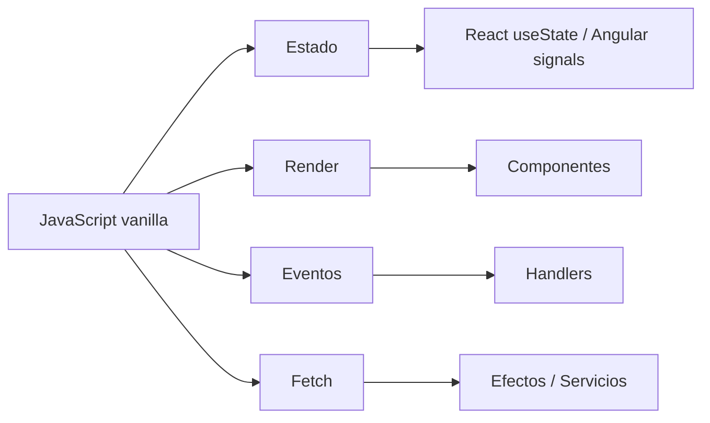

# 20. Preparación para React 19 y Angular desde JavaScript moderno

[Volver al índice general](../INDICE_GENERAL.md)

Esta unidad sirve como cierre del bloque de JavaScript y como puente hacia frameworks. No sustituye a un curso de React o Angular: ordena los conceptos de JavaScript que deben estar claros antes de empezar.

---

## 20.1. Qué debe saber el alumno antes de empezar

### 20.1.1. Lenguaje y datos

- Crear funciones pequeñas y reutilizables.
- Entender parámetros, valores de retorno y callbacks.
- Transformar arrays con `map`, `filter`, `find`, `some`, `every` y `reduce`.
- Copiar objetos y arrays sin mutarlos directamente.
- Desestructurar objetos y arrays.
- Manejar `Set`, `Map`, JSON y `Object.entries()`.

### 20.1.2. Organización y reutilización

- Usar módulos ES con `import` y `export`.
- Separar lógica en archivos pequeños.
- Entender cuándo una función debe ser pura.
- Saber qué parte del código es estado y cuál es presentación.
- Evitar mezclar renderizado con reglas de negocio.

### 20.1.3. Navegador y UI

- Entender eventos del DOM y formularios.
- Usar `addEventListener`, delegación y `preventDefault()`.
- Manipular `classList`, `dataset` y atributos.
- Saber construir una interfaz desde datos.

### 20.1.4. Asincronía y APIs

- Consumir APIs con `fetch` y `async/await`.
- Gestionar estados de carga, éxito y error.
- Comprobar respuestas HTTP con `response.ok`.
- Manejar excepciones con `try/catch`.
- Saber cuándo usar `AbortController`.

### 20.1.5. Arquitectura para frameworks

- Separar estado, renderizado, eventos, API y persistencia.
- Entender cómo un `render()` vanilla se convierte en un componente.
- Entender cómo un objeto `estado` se convierte en `useState`, `signals` o un servicio.
- Entender cómo un formulario en vanilla se convierte en Actions o en Reactive Forms.

### 20.1.6. JavaScript avanzado que más se usa en React y Angular

| Concepto | Por qué importa | Dónde aparece |
| --- | --- | --- |
| `map`, `filter`, `find`, `some`, `every`, `reduce` | Pintar listas, filtrar datos y preparar vistas | Componentes, selectores, reducers, templates |
| Spread, rest y destructuring | Actualizar estado sin mutar y extraer datos de forma clara | Hooks, servicios, inputs, formularios |
| Funciones puras | Reducir efectos secundarios y facilitar pruebas | Lógica de UI, utilidades, transformaciones |
| Inmutabilidad | Evitar bugs al actualizar estado | React, signals, reducers, stores |
| Closures | Recordar contexto sin clases innecesarias | Handlers, factories, hooks, servicios |
| Módulos ES | Separar lógica en archivos reutilizables | Componentes, servicios, utilidades |
| `async/await` y `fetch` | Consumir APIs con estados de carga y error | Efectos, servicios, loaders, actions |
| `localStorage` | Persistir preferencias o borradores | Efectos, servicios, sincronización |
| Formularios | Leer, validar y normalizar entradas | Forms, Reactive Forms, Actions |
| Eventos del DOM | Responder a clicks, inputs y submits | Handlers, templates, listeners |
| `try/catch` y `response.ok` | Controlar fallos reales de red | Servicios HTTP y flujos de error |
| `AbortController` | Cancelar peticiones y evitar respuestas obsoletas | Búsquedas, autocompletado, navegación |

### 20.1.7. Qué conviene dominar antes de saltar a React o Angular

- Crear y actualizar listas desde arrays de objetos.
- Filtrar, ordenar y agrupar datos sin mutar el original.
- Separar una app en `state`, `render`, `events`, `storage` y `api`.
- Validar formularios con funciones pequeñas.
- Manejar carga, éxito y error en peticiones reales.
- Identificar qué parte de la lógica será componente, qué parte será servicio y qué parte será utilidad.
- Reescribir una solución imperativa como una solución más declarativa.
- Explicar qué problema resuelve el framework y qué parte sigue siendo JavaScript normal.

---

## 20.2. De función render a componente

En JavaScript vanilla podemos escribir:

```javascript
function renderAlumno(alumno) {
  return `
    <article>
      <h2>${alumno.nombre}</h2>
      <p>${alumno.curso}</p>
    </article>
  `;
}
```

En React, la misma idea se convierte en componente:

```jsx
function AlumnoCard({ alumno }) {
  return (
    <article>
      <h2>{alumno.nombre}</h2>
      <p>{alumno.curso}</p>
    </article>
  );
}
```

En Angular, se reparte entre clase y template:

```typescript
type Alumno = {
  nombre: string;
  curso: string;
};
```

```html
<article>
  <h2>{{ alumno.nombre }}</h2>
  <p>{{ alumno.curso }}</p>
</article>
```

---

## 20.3. De estado manual a estado de framework

```javascript
const estado = {
  tareas: [],
  filtro: "todas",
};
```

En React:

```jsx
const [tareas, setTareas] = useState([]);
const [filtro, setFiltro] = useState("todas");
```

En Angular moderno:

```typescript
tareas = signal<Tarea[]>([]);
filtro = signal("todas");
```

---

## 20.4. Diagrama mental



---

## 20.5. Proyecto de cierre recomendado

Crear un gestor académico con:

- listado de tareas o entregas;
- creación mediante formulario;
- edición y borrado;
- filtros;
- persistencia en `localStorage`;
- carga inicial desde API;
- separación en módulos;
- versión posterior en React o Angular.

---

## 20.6. Material relacionado

- [Ruta JS -> React / Angular](../docs/RUTA_JS_REACT_ANGULAR.md)
- [Práctica puente React 19](../Ejercicios/Practica_Puente_React_19.md)
- [Diagramas explicativos](../docs/DIAGRAMAS.md)
- [Banco ampliado de ejercicios](../Ejercicios/Banco_Ejercicios_JavaScript_Avanzado.md)
- [Metodologías de programación](../docs/METODOLOGIAS_JS.md)
- [Clean Code aplicado a JavaScript](../docs/CLEAN_CODE_JAVASCRIPT.md)

---

[Volver al índice general](../INDICE_GENERAL.md)
