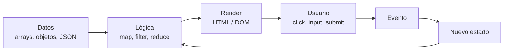
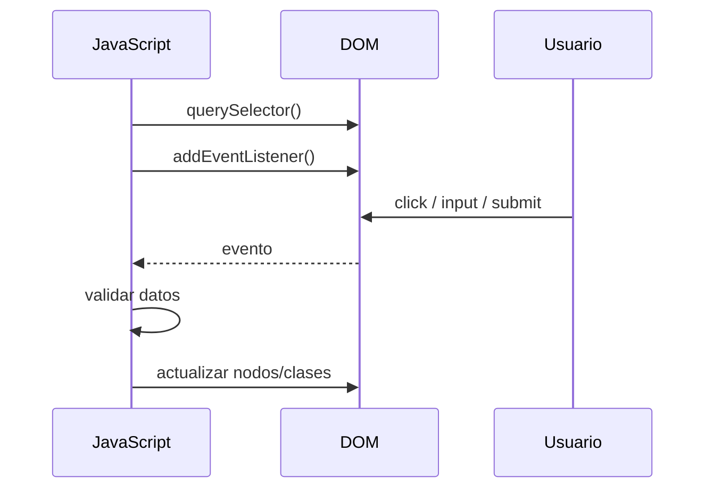
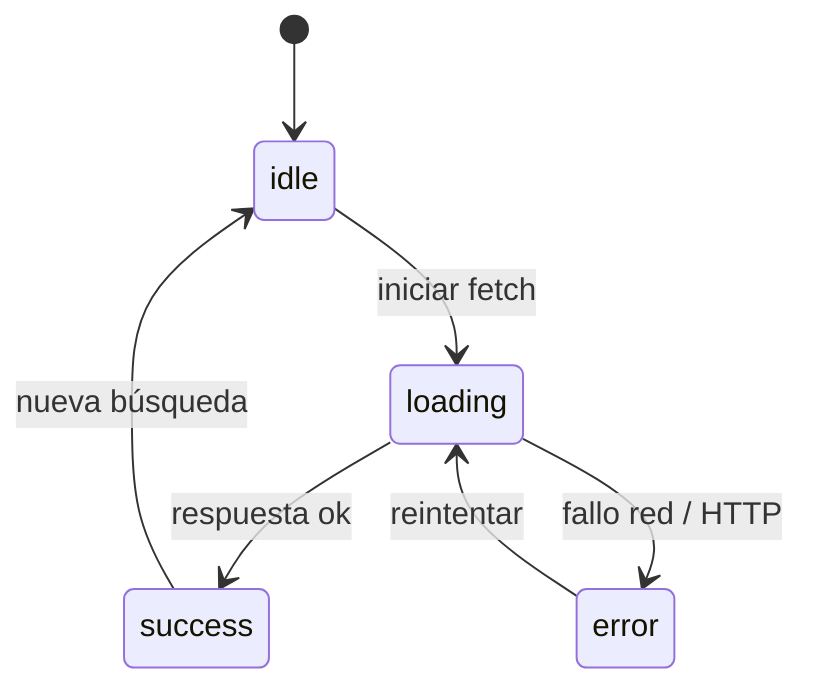
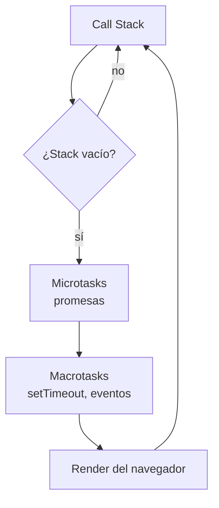
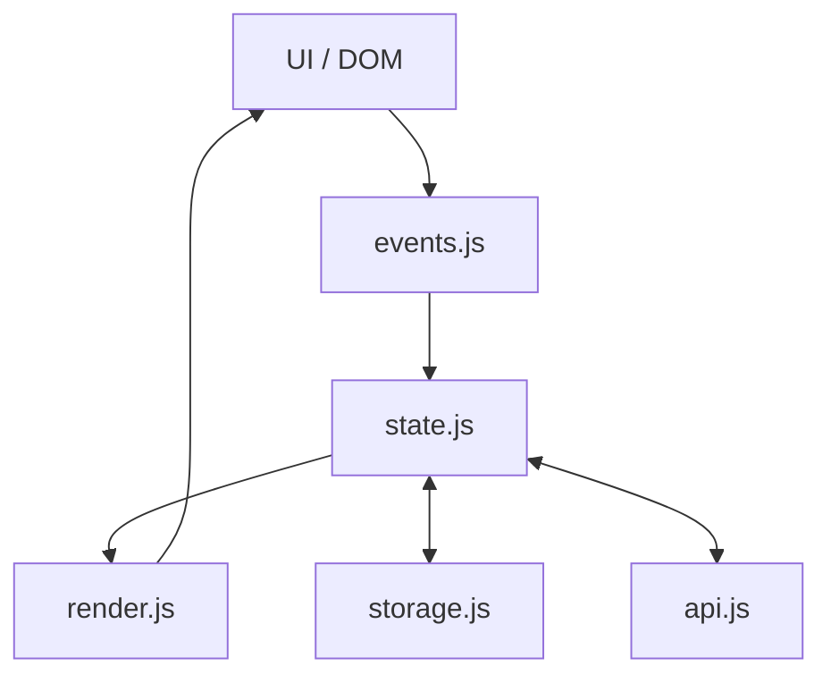
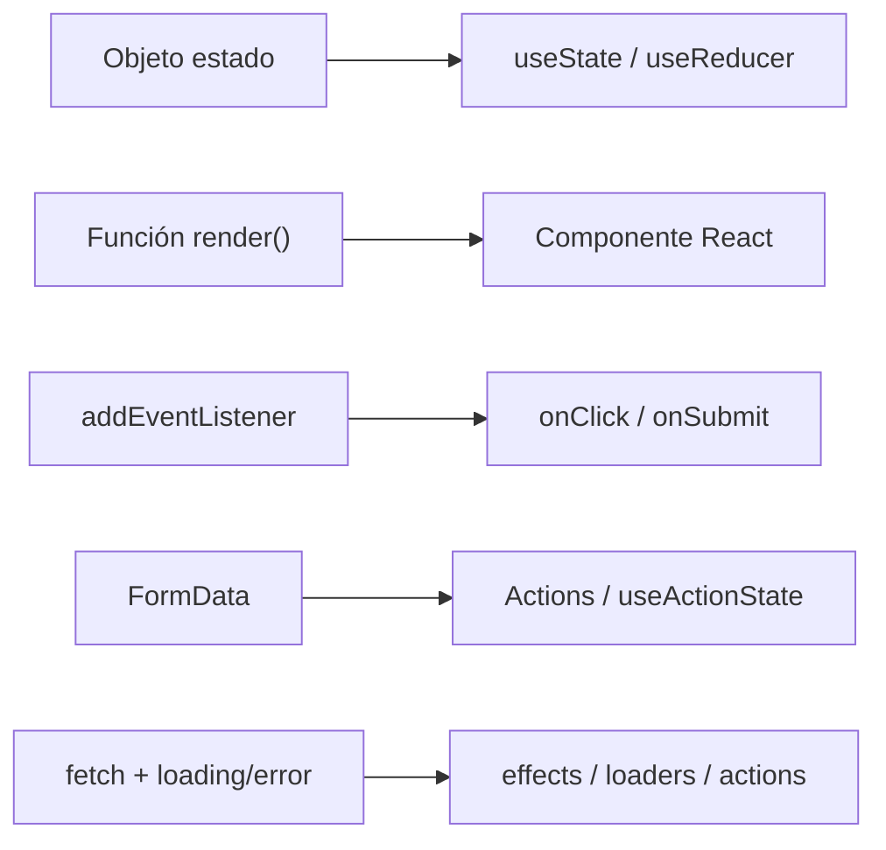
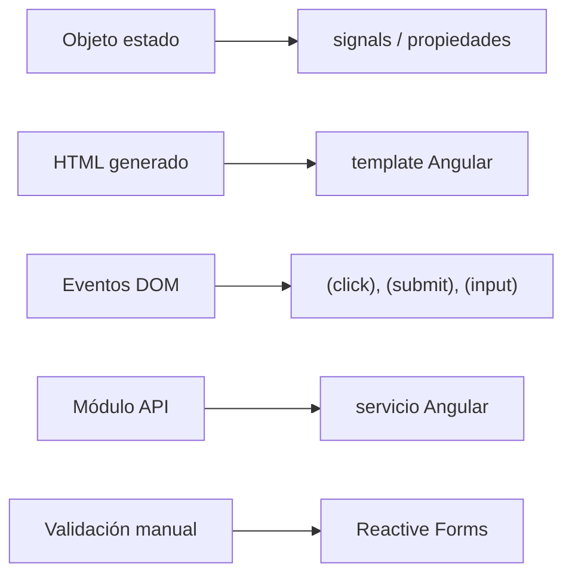

# Diagramas explicativos

Colección de diagramas Mermaid para reforzar conceptos clave de JavaScript antes de pasar a React o Angular.

> [!NOTE]
> Estos diagramas están pensados para clase: primero se explica el flujo, después se mira el código.

---

## 1. Del dato a la interfaz

Idea principal: la interfaz debe salir de los datos. Cuando el usuario interactúa, cambia el estado y se vuelve a pintar.

---

## 2. Flujo DOM clásico

Este flujo ayuda a entender por qué en React y Angular se intenta evitar tocar el DOM manualmente en cada paso.

---

## 3. Estados de una petición fetch

Toda petición real necesita pensar en:

- Estado inicial.
- Carga.
- Éxito.
- Error.
- Reintento o nueva acción.

---

## 4. Event loop simplificado

Este diagrama sirve para explicar por qué una promesa se resuelve antes que un `setTimeout(..., 0)`.

---

## 5. Arquitectura vanilla recomendada

Separar archivos evita que una práctica pequeña se convierta en un único `main.js` difícil de mantener.

---

## 6. Puente mental a React

React no cambia los problemas: cambia la forma de organizarlos.

---

## 7. Puente mental a Angular

Angular tiende a separar más la arquitectura: componente, template, servicios y formularios.

---

[Volver al índice general](../INDICE_GENERAL.md)
